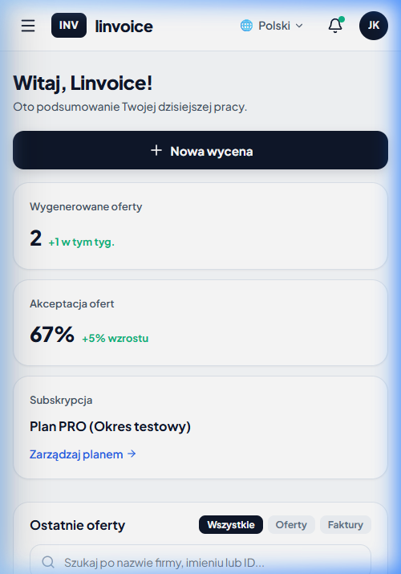
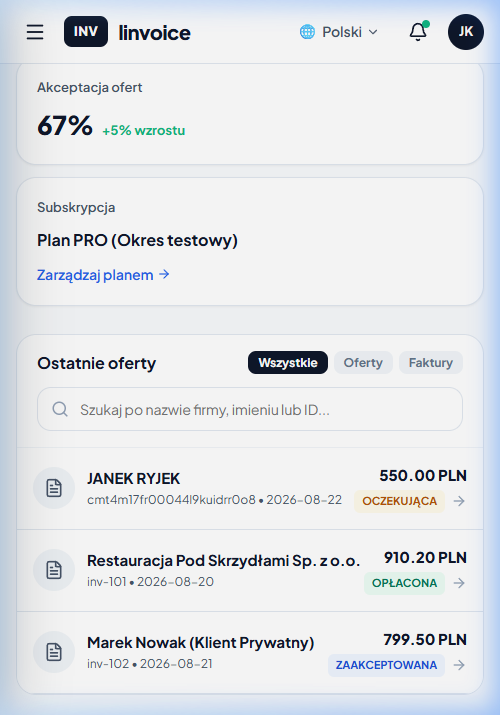
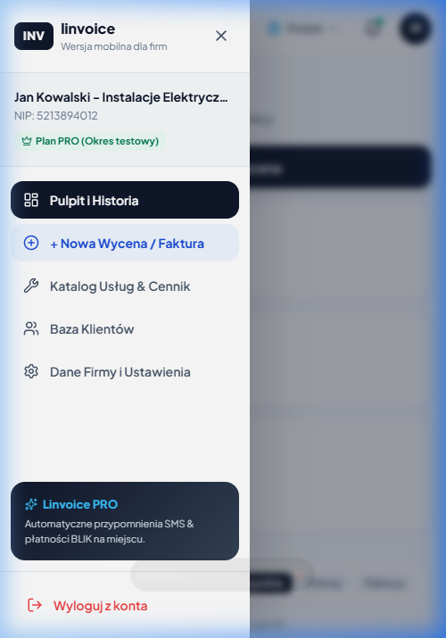

# ⚡ linvoice — Express Mobile Invoicing & Quotes for Tradesmen & Contractors



> **Szybkie faktury i wyceny w 3 krokach prosto z budowy dla hydraulików, elektryków, stolarzy i firm wykończeniowych.**

---

## 📸 Zrzuty Ekranu Aplikacji (Screenshots)

<div align="center">

| 📊 Pulpit & Historia Wycen | ⚡ Zaciąganie z GUS po NIP |
| :---: | :---: |
|  |  |

| 🛠️ Kreator Usług na Budowie | 📖 Katalog Usług & Cennik |
| :---: | :---: |
|  |  |

| 👥 Baza Klientów z NIP |
| :---: |
|  |

</div>

---

## 🔥 Kluczowe Funkcje (Key Features)

- ⚡ **Wystawianie wyceny/faktury w 30 sekund** — Błyskawiczny 3-krokowy wizard zaprojektowany pod chwyt jedną ręką na telefonie.
- 🏢 **Automatyczne pobieranie z GUS / Ministerstwa Finansów** — Wpisz 10-cyfrowy NIP klienta, a system w 0.2s uzupełni nazwę, ulicę, miasto, kod pocztowy i e-mail.
- 🛠️ **Szybki Katalog Usług & Cennik** — Liczniki `+` i `-` umożliwiają szybkie dodawanie gotowych pozycji (np. *Montaż punktu elektrycznego*, *Wymiana syfonu*) bezpośrednio u klienta.
- 📱 **Szybkie płatności BLIK QR na miejscu** — Generowanie kodu QR i danych do szybkiego przelewu BLIK na budowie.
- 📄 **Generowanie PDF i wysyłka SMS / WhatsApp** — Profesjonalne faktury i wyceny w formacie PDF gotowe do udostępnienia jednym kliknięciem.
- 🔒 **Subskrypcja PRO z 3-dniowym Trialem** — System darmowych testów, baner z odliczaniem czasu oraz wbudowany Paywall z możliwością płatności i anulowania subskrypcji.

---

## 🛠️ Technologie (Tech Stack)

- **Frontend:** React 19 + TypeScript
- **Bundler / Build:** Vite 8 + OXC
- **Styling:** Mobile-first Vanilla CSS (Design system inspirowany glassmorphism i dark UI)
- **Generowanie PDF:** `jspdf`
- **Efekty & Animacje:** `canvas-confetti`, `lucide-react`
- **Płatności & Dane:** LocalStorage Storage Manager z hybrydowym polskim API rejestru VAT/GUS

---

## 🚀 Jak uruchomić lokalnie (Getting Started)

### Wymagania
- Node.js `v18+`
- npm `v9+`

### Klonowanie i instalacja

```bash
# 1. Klonowanie repozytorium
git clone https://github.com/Diabue/Linvoice.git
cd Linvoice

# 2. Instalacja zależności
npm install

# 3. Uruchomienie serwera deweloperskiego (z obsługą połączeń mobilnych w Wi-Fi)
npm run dev
```

Po uruchomieniu otwórz w przeglądarce:
- Na komputerze: `http://localhost:5173/`
- Na telefonie (w tej samej sieci Wi-Fi): `http://192.168.x.x:5173/`

---

## 📄 Licencja

Projekt stworzony dla **linvoice** — aplikacja wycen i faktur dla fachowców.
